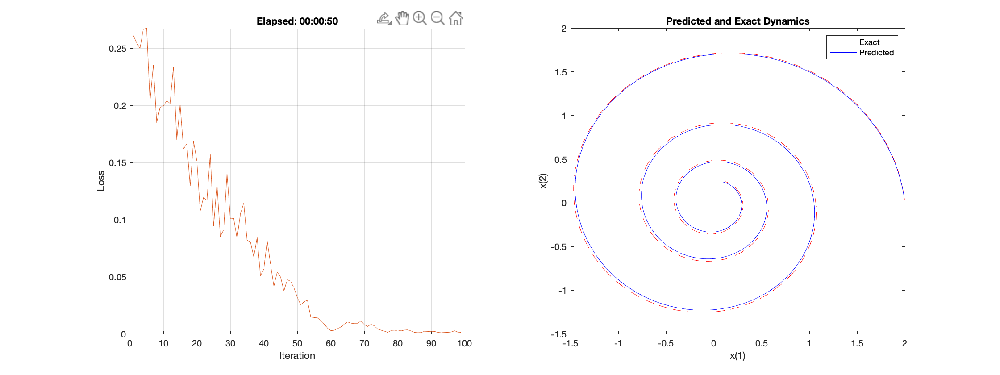

# Neural ODEs

First introduced in [[1]](#1), neural ODEs offer a new deep neural network paradigm where the output of a neural network is computed through a differential equation solver. This method has a much lower memory cost than ResNets, due to continuous-depth. Here is a simple implementation of the supervised learning of a dynamical system in MATLAB.

# Dependencies

MATLAB_R2021 or MATLAB_R2022 with the [Deep Learning Toolbox](https://www.mathworks.com/products/deep-learning.html).

An explanation of the MATLAB functions used can be found [here](https://www.mathworks.com/help/deeplearning/ug/dynamical-system-modeling-using-neural-ode.html).
 
To run, call neural_ode.m from /code in a MATLAB command window.

Output example:

## References
<a id="1">[1]</a> 
Ricky T. Q. Chen et al. “Neural Ordinary Differential Equations”. In: Advances in Neural Information Processing Systems. Ed. by S. Bengio et al. Vol. 31. Curran Associates, Inc., 2018.
